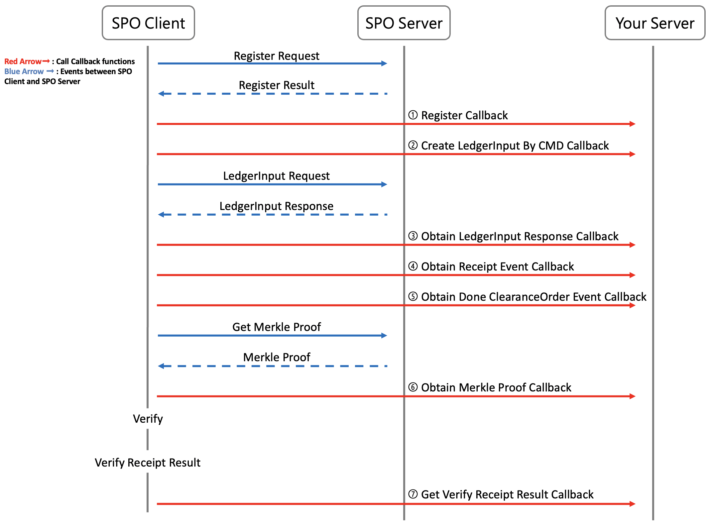
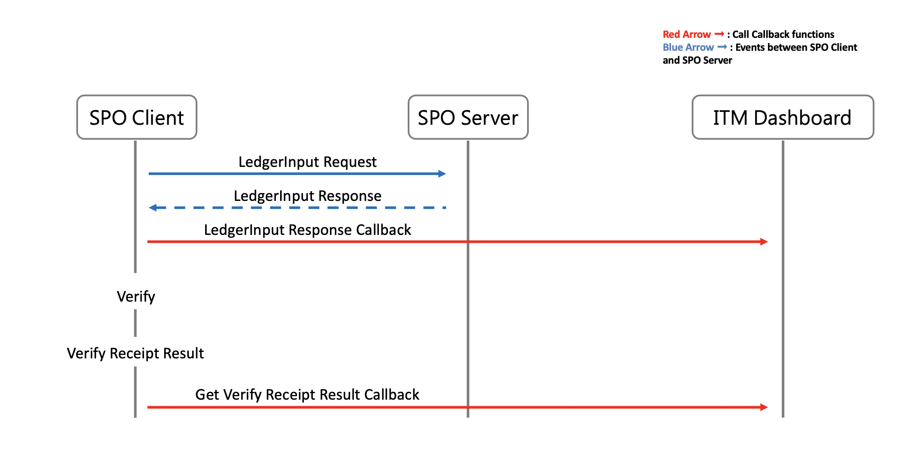
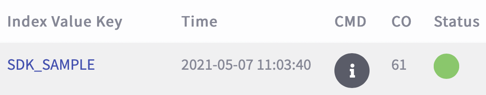
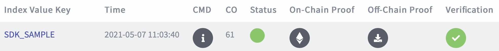
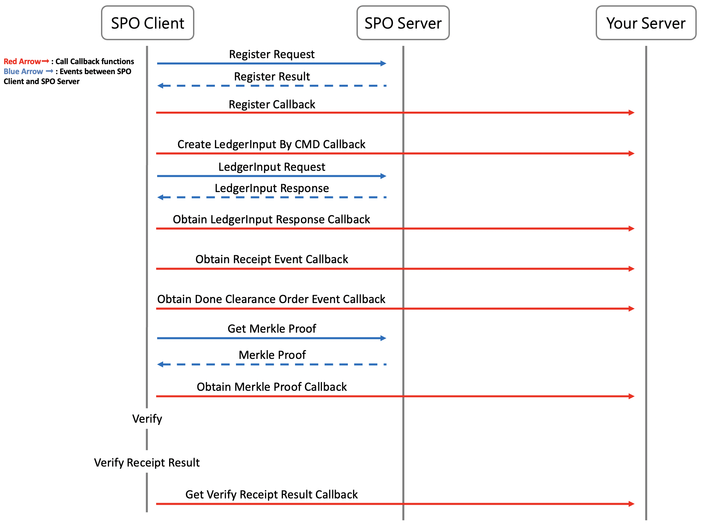

## Callback 串接實作說明

### 關於 Callback 實作說明文件

- Callback 的功能為將 SPO Client 與 SPO Server 之間發生的事件傳送至 [ITM 公版 Dashboard](https://azure-prod-rinkeby.itm.monster:8443/) 顯示或是自己的系統中。在上一份文件中，你已經了解如何設計 CMD。在這份文件中，我們將引導您了解 Callback 如何將事件傳送至 [ITM 公版 Dashboard](https://azure-prod-rinkeby.itm.monster:8443/) 以及實作 Callback 將事件傳送至自己的系統。

- 我們總共定義 8 個事件可以 Callback，分別為 :

  

  1. `register` : SPO Client 初始化時，會向 SPO Server 進行註冊，開發者可實作此方法將 `registerRequest` 和 `registerResult` Callback
  
  2. `createLedgerInputByCmd` :
      - SPO Client 初始化成功，會將 CMD 等資訊放入 `ledgerInputRequst` 並進行 **ledgerInput** 開發者可實作此方法將 `ledgerInputRequest` Callback。
      - 若開發者使用 CMD 文件中的檔案存證功能，SPO Client 會將 CMD 等資訊放入 `ledgerInputRequst` 並進行 **binaryLedgerInput** 開發者可實作此方法將 `ledgerInputRequest` Callback
  
  3. `obtainLedgerInputResponse` : SPO Client ledgerInput 後會收到 SPO Server 回傳的 `ledgerInputResult`，開發者可實作此方法將 `ledgerInputResult` Callback
  
  4. `obtainBinaryLedgerInputResponse` : 若開發者使用 CMD 文件中的檔案存證功能，SPO Client 會進行 `binaryLedgerInput`，並會收到 SPO Server 回傳的 `binaryLedgerInputResult`，開發者可實作此方法將 `binaryLedgerInputResult` Callback
  
  5. `obtainReceiptEvent` : 將 `ledgerInputResult` / `binaryLedgerInputResult` 中的 `receipt` Callback
  
  6. `obtainDoneClearanceOrderEvent` : 將 `ledgerInputResult` / `binaryLedgerInputResult` 中的 `doneClearanceOrder` Callback
  
  7. `obtainMerkleProof` : SPO Client 驗證回條前，會先向 SPO Server 拿取 MerkleProof 作為驗證依據，開發者可實作使方法將 `merkleProof` Callback
  
  8. `getVerifyReceiptResult` : SPO Client 取得 MerkleProof 後會開始驗證回條，並將驗證結果放入 `verifyReceiptResult`，開發者可實作此方法將 `verifyReceiptResult` Callback
  
- 此文件分成兩部分
  - **[入門](#入門)** : 使用 ITM 公版 Dashboard 作為範例，說明 `obtainLedgerInputResponse` 和 `getVerifyReceiptResult` 如何將事件 Callback 至 [ITM 公版 Dashboard](https://azure-prod-rinkeby.itm.monster:8443)
  - **[進階](#進階)** : 此進階文件將引導開發者了解 8 個事件的運作流程以及實作時每個 Callback 的注意事項
  
- Callback 實作注意事項

  - 若開發者想直接使用 ITM 公版 Dashboard，僅需了解入門文件中的兩個 Callback 運作流程且不需更改任何程式
  - **若開發者想使用其他 Callback 請閱讀進階文件並實作 Callback 將事件傳送至自己的系統，因 ITM 公版 Dashboard API 僅提供 `obtainLedgerInputResponse` 和 `getVerifyReceiptResult` 串接**

- Callback 相關檔案

  - [CallbackSample.java](../src/main/java/com/itrustmachines/sample/CallbackSample.java)
  - [SpoClientCallback.java](../../spo-client/src/main/java/com/itrustmachines/client/todo/SpoClientCallback.java)
  - [DashboardService.java](../src/main/java/com/itrustmachines/sample/DashboardService.java)

### 入門

- 使用 ITM 公版 Dashboard 作為範例，說明 `obtainLedgerInputResponse` 和 `getVerifyReceiptResult` 兩個最基本的 Callback
- 開發者閱讀 Callback 說明時，可參考說明下方的程式以方便理解。

- 關係圖
  

#### obtainLedgerInputResponse 說明

- 用戶在 ITM 公版 Dashboard 中看到的存證資料資訊便是透過此 Callback 將資料傳送至 Dashboard 上顯示。
  

- SPO Client 將 CMD 傳送至 SPO Server 存證上鏈這個動作我們稱為 `ledgerInput`。每次 `ledgerInput` 後 SPO Server 會回傳 `ledgerInputResponse` 給 SPO Client。`ledgerInputResponse` 中包含回條、已完成清算序號、狀態 ... 等資訊。

- SPO Client 收到 `ledgerInputResponse` 後，會呼叫 [CallbackSample.java](../src/main/java/com/itrustmachines/sample/CallbackSample.java) 中的 `obtainLedgerInputResponse` 方法將回條中的 `clearanceOrder` 和 `indexValue` 儲存至 `receiptLocator`，然後呼叫 [DashboardService.java](../src/main/java/com/itrustmachines/sample/DashboardService.java) 中的 `postDeviceData` 方法將要 Callback 的資訊儲存至 `req` 並透過 `device-data-input-api` POST 至 ITM 公版 Dashboard 上
  
- 為確保每次 Callback 的 `clearanceOrder` 和 `indexValue` 正確性以及方便用戶日後查詢存證資料，所以我們會從回條中複製 `clearanceOrder` 和 `indexValue` 至 `receiptLocator` Callback 至 ITM 公版 Dashboard

- API 資訊可參考 [ITM Dashboard API](https://azure-prod-rinkeby.itm.monster:8443/swagger-ui/)

- API URL 設定可參考 [DashboardService.java](../src/main/java/com/itrustmachines/sample/DashboardService.java)

- [CallbackSample.java](../src/main/java/com/itrustmachines/sample/CallbackSample.java)
  
  ```java
  public void obtainLedgerInputResponse(ReceiptLocator locator, String cmdJson,
      LedgerInputResponse ledgerInputResponse) {

    final DashboardService.DeviceDataResponse response;
    if (StatusConstants.OK.name()
                          .equalsIgnoreCase(ledgerInputResponse.getStatus())) {
      final Receipt receipt = ledgerInputResponse.getReceipt();
      final ReceiptLocator receiptLocator = ReceiptLocator.builder()
                                                          .indexValue(receipt.getIndexValue())
                                                          .clearanceOrder(receipt.getClearanceOrder())
                                                          .build();
      final Cmd cmd = new Gson().fromJson(receipt.getCmd(), Cmd.class);
      response = dashboardService.postDeviceData(receiptLocator, ledgerInputResponse.getStatus(), cmd);
    } else {
      final Cmd cmd = new Gson().fromJson(cmdJson, Cmd.class);
      response = dashboardService.postDeviceData(locator, ledgerInputResponse.getStatus(), cmd);
    }
    log.info("obtainLedgerInputResponse() dashboard response={}", response);
  }
  ```

- [DashboardService.java](../src/main/java/com/itrustmachines/sample/DashboardService.java)
  
  ```java
  public DeviceDataResponse postDeviceData(@NonNull final ReceiptLocator locator, @NonNull final String status,
      @NonNull final Object cmd) {
    
    log.debug("postDeviceData() begin, locator={}, status={}, cmd={}", locator, status, cmd);
    final DeviceDataRequest req = DeviceDataRequest.builder()
                                                   .clearanceOrder(locator.getClearanceOrder())
                                                   .indexValue(locator.getIndexValue())
                                                   .status(status)
                                                   .cmd(cmd)
                                                   .build();
    
    final String url = dashboardUrl + DEVICE_DATA_PATH;
    final Request request = new Request.Builder().url(url)
                                                 .post(RequestBody.create(gson.toJson(req), JSON))
                                                 .build();
    
    DeviceDataResponse res;
    try (Response response = okHttpClient.newCall(request)
                                         .execute()) {
      final String resString = Objects.requireNonNull(response.body())
                                      .string();
      res = gson.fromJson(resString, DeviceDataResponse.class);
      
      log.debug("postDeviceData() end, res={}", res);
      return res;
    }
  }
  ```

#### getVerifyReceiptResult 說明

- 用戶在 ITM 公版 Dashboard 中看到的驗證結果資訊便是透過此 Callback 將驗證資料傳送至 Dashboard 上顯示。
  

- SPO Client 驗證回條後，會將驗證結果儲存至 `verifyReceiptAndMerkleProofResult` 並呼叫 [CallbackSample.java](../src/main/java/com/itrustmachines/sample/CallbackSample.java) 中的 `getVerifyReceiptResult` 方法將 `verifyReceiptAndMerkleProofResult` Callback 到 ITM 公版 Dashboard 上顯示

- `getVerifyReceiptResult` 方法會呼叫 [DashboardService.java](../src/main/java/com/itrustmachines/sample/DashboardService.java) 中的 `postVerifyReceiptAndMerkleProofResult` 方法將 `verifyReceiptAndMerkleProofResult` 內的資訊儲存至 `res` 並透過 `verify-log-api` POST 至 ITM 公版 Dashboard

- 為了更新存證資料的驗證狀態，所以在 Callback 時我們會將 `verifyReceiptAndMerkleProofResult` 中的 `clearanceOrder` 和 `indexValue` Callback 至 ITM 公版 Dashboard

- API 資訊可參考 [ITM Dashboard API](https://azure-prod-rinkeby.itm.monster:8443/swagger-ui/)

- API URL 設定在 [DashboardService.java](../src/main/java/com/itrustmachines/sample/DashboardService.java)

- [CallbackSample.java](../src/main/java/com/itrustmachines/sample/CallbackSample.java)
  
  ```java
  public void getVerifyReceiptResult(Receipt receipt, MerkleProof merkleProof,
      VerifyReceiptAndMerkleProofResult verifyReceiptAndMerkleProofResult) {

    final DashboardService.VerifyReceiptResultResponse response = dashboardService.postVerifyReceiptAndMerkleProofResult(
        verifyReceiptAndMerkleProofResult);
    log.info("getVerifyReceiptResult() dashboard response={}", response);
  }
  ```

- [DashboardService.java](../src/main/java/com/itrustmachines/sample/DashboardService.java)
  
  ```java
  public VerifyReceiptResultResponse postVerifyReceiptAndMerkleProofResult(
      @NonNull final VerifyReceiptAndMerkleProofResult verifyResult) {
    log.debug("postVerifyReceiptAndMerkleProofResult() begin, verifyResult={}", verifyResult);
    
    final String url = dashboardUrl + LOG_VERIFY_RECEIPT_RESULT;
    
    final Request request = new Request.Builder().url(url)
                                                 .post(RequestBody.create(gson.toJson(verifyResult), JSON))
                                                 .build();
    
    VerifyReceiptResultResponse res;
    try (final Response response = okHttpClient.newCall(request)
                                               .execute()) {
      final String resString = Objects.requireNonNull(response.body())
                                      .string();
      res = gson.fromJson(resString, VerifyReceiptResultResponse.class);
      log.debug("postVerifyReceiptAndMerkleProofResult() end, res={}", res);
      return res;
    }
  }
  ```

- 您現在已經了解兩個最基本的 Callback 服務。若您要使用其他 Callback 服務則請接續閱讀進階文件了解其他 Callback 功能並整合至自己的系統。ITM Dashboard API 無提供 API 讓其他 Callback 與 ITM 公版 Dashboard 進行串接
- 若您想直接使用 ITM 公版 Dashboard，則不需更改任何程式，可前往下一章閱讀 [reciptDao 功能說明](./receiptDao_zh.md)，了解 SPO Client 是如何存取回條及尋找待驗證的回條。

### 進階

- 此進階文件會介紹 8 種事件的Callback 因此篇幅較長，建議開發者閱讀各事件說明時可一併參考說明下方的程式以方便理解。
- 關係圖
  

#### register 說明

##### SPO Client 初始化時，會向 SPO Server 進行註冊，若您想將註冊資訊 Callback 至自己的系統，可閱讀下方說明及程式

- SPO Client 初始化時，[SpoClient.java](../../spo-client/src/main/java/com/itrustmachines/client/BnsClient.java) 會呼叫 [RegisterService.java](../../spo-client/src/main/java/com/itrustmachines/client/register/service/RegisterService.java) 中的 `register` 方法建立 `registerRequest` 並向 SPO Server 請求註冊

- SPO Server 收到請求註冊後會將註冊結果回傳給 SPO Client，SPO Client 會透過 `register` 中的 `checkResponse` 方法將註冊結果資訊放入 `registerResult`

- 開發者可在 [CallbackSample.java](../src/main/java/com/itrustmachines/sample/CallbackSample.java) 的 `register` 撰寫程式將 `registerRequest` 和 `registerResult` Callback 至自己的系統

- [SpoClient.java](../../spo-client/src/main/java/com/itrustmachines/client/BnsClient.java)
  
  ```java
  public static SpoClient init(@NonNull final SpoClientConfig config, @NonNull final SpoClientCallback callback,
      @NonNull final SpoClientReceiptDao receiptDao) {
    if (config.getVerifyBatchSize() <= 0) {
      config.setVerifyBatchSize(SpoClientConfig.DEFAULT_VERIFY_BATCH_SIZE);
    }
    SpoClient spoClient = new SpoClient(config, callback, receiptDao);
    final boolean isRegistered = spoClient.registerService.register();
    if (!isRegistered) {
      String errMsg = "SpoClient register fail";
      log.error("init() error, {}", errMsg);
      throw new RuntimeException(errMsg);
    }
    return spoClient;
  }
  ```

- [RegisterService.java](../../spo-client/src/main/java/com/itrustmachines/client/register/service/RegisterService.java)
  
  ```java
  public boolean register() {
    final RegisterRequest registerReq = buildRegisterRequest(keyInfo);
    
    RegisterResponse res = null;
    for (int retryCount = 0; retryCount <= MAX_RETRY_TIMES; retryCount++) {
      log.debug("register() retryCount={}", retryCount);
      try {
        res = postRegister(registerReq);
        log.debug("register() res={}", res);
        if (checkResponse(res)) {
          break;
        }
      } catch (Exception e) {
        // ...
      }
    }
    
    if (res == null) {
      String errMsg = "response is null";
      log.error("register() fail, {}", errMsg);
      throw new NullPointerException(errMsg);
    }
    
    try {
      spoClientCallback.register(registerReq, res.getStatus());
    } catch (Exception e) {
      // ...
      log.error("register() callback register error, registerReq={}, status={}", registerReq, res.getStatus(), e);
    }
    
    final boolean result = checkRegisterResult(res);
    log.debug("register() result={}", result);
    return result;
  }
  ```

- [CallbackSample.java](../src/main/java/com/itrustmachines/sample/CallbackSample.java)

  ```java
  public void register(RegisterRequest registerRequest, String registerResult) {
  }
  ```

#### createLedgerInputByCmd 說明

##### SPO Client 初始化成功，會將 CMD 等資訊放入 ledgerInputRequst 並進行 ledgerInput，若您想將 ledgerInputRequst 的資訊 Callback 至自己的系統，可閱讀下方說明及程式

- SPO Client 初始化成功後，[SpoClient.java](../../spo-client/src/main/java/com/itrustmachines/client/BnsClient.java) 會呼叫 [LedgerInputService.java](../../spo-client/src/main/java/com/itrustmachines/client/input/service/LedgerInputService.java) 中的 `ledgetInput` 方法進行 ledgerInput

- `ledgetInput` 方法在進行 ledgerInput 前會呼叫 `buildLedgerInputRequest` 方法將 `CMD`, `indexValue` ... 等資訊放入 `ledgerInputRequest`

- `ledgerInputRequest` 為 Class 資料型別，內容可參考 [LedgerInputRequest.java](../../spo-client/src/main/java/com/itrustmachines/client/input/vo/LedgerInputRequest.java)

- 開發者可在 [CallbackSample.java](../src/main/java/com/itrustmachines/sample/CallbackSample.java) 的 `createLedgerInputByCmd` 撰寫程式將 `ledgerInputRequest` 的資訊 Callback 至自己的系統

- **建議實作時可將 `ledgerInputRequest` 中的 `clearanceOrder` 和 `indexValue` 儲存至 `receiptLocator`** 方便日後搜尋資料

- [SpoClient.java](../../spo-client/src/main/java/com/itrustmachines/client/BnsClient.java)
  
  ```java
  public LedgerInputResponse ledgerInput(@NonNull final String indexValueKey, @NonNull final String cmdJson) {
    return ledgerInputService.ledgerInput(indexValueKey, cmdJson);
  }
  ```

- [LedgerInputService.java](../../spo-client/src/main/java/com/itrustmachines/client/input/service/LedgerInputService.java)
  
  ```java
  public LedgerInputResponse ledgerInput(final @NonNull String indexValueKey, final @NonNull String cmdJson) {
    log.debug("ledgerInput() begin, indexValueKey={}, cmdJson={}", indexValueKey, cmdJson);
    
    // do ledger input, resend if necessary
    ReceiptLocator locator = null;
    LedgerInputRequest ledgerInputRequest;
    LedgerInputResponse res = null;
    for (int resendCount = 0; resendCount <= MAX_RESEND_TIMES; resendCount++) {
      log.debug("ledgerInput() resendCount={}", resendCount);
      try {
        // build LedgerInput by cmdJson
        locator = receiptLocatorService.obtainReceiptLocator(indexValueKey);
        ledgerInputRequest = buildLedgerInputRequest(locator, cmdJson);
        try {
          callback.createLedgerInputByCmd(locator, ledgerInputRequest);
        } catch (Exception e) {
          // ...
        }
        res = postLedgerInput(ledgerInputRequest);
        log.debug("ledgerInput() res={}", res);
        if (checkResponse(res)) {
          break;
        }
      } catch (Exception e) {
        // ...
        TimeUnit.SECONDS.sleep(retryDelaySec);
      }
    }
    // ...
  }

  LedgerInputRequest buildLedgerInputRequest(final @NonNull ReceiptLocator locator, final @NonNull String cmdJson) {
    final LedgerInputRequest result = LedgerInputRequest.builder()
                                                        .callerAddress(keyInfo.getAddress())
                                                        .timestamp("" + System.currentTimeMillis())
                                                        .cmd(cmdJson)
                                                        .indexValue(locator.getIndexValue())
                                                        .metadata("")
                                                        .clearanceOrder(locator.getClearanceOrder())
                                                        .build()
                                                        .sign(keyInfo.getPrivateKey());
    log.debug("buildLedgerInputRequest() result={}", result);
    return result;
  }
  ```

- [CallbackSample.java](../src/main/java/com/itrustmachines/sample/CallbackSample.java)

  ```java
  public void createLedgerInputByCmd(ReceiptLocator receiptLocator, LedgerInputRequest ledgerInputRequest) {
  }
  ```

#### obtainLedgerInputResponse 說明

##### SPO Client ledgerInput 後會收到 SPO Server 回傳的 ledgerInputResult，若您想將 ledgerInputResult 的資訊 Callback 至自己的系統，可閱讀下方說明及程式

- SPO Client 將 `ledgerInputRequest` 傳送至 SPO Server 進行存證後，SPO Server 會將存證結果回傳給 SPO Client

- SPO Client 會透過 [LedgerInputService.java](../../spo-client/src/main/java/com/itrustmachines/client/input/service/LedgerInputService.java) 中的 `checkResponse` 方法將存證結果放入 `ledgerInputResponse`

- `ledgerInputResponse` 為 Class 資料型別，內容可參考 [LedgerInputResponse.java](../../spo-client/src/main/java/com/itrustmachines/client/input/vo/LedgerInputResponse.java)

- 開發者可在 [CallbackSample.java](../src/main/java/com/itrustmachines/sample/CallbackSample.java) 的 `obtainLedgerInputResponse` 撰寫程式將 `ledgerInputResponse` 的資訊 Callback 至自己的系統

- 實作方式可參考 [DashboardService.java](../src/main/java/com/itrustmachines/sample/DashboardService.java)

- **建議實作時可將 `ledgerInputResponse` 中的 `clearanceOrder` 和 `indexValue` 儲存至 `receiptLocator`**，方便日後搜尋資料

- 除了將 `ledgerInputResponse` Callback 外，**開發者可實作 `obtainReceiptEvent` 和  `obtainDoneClearanceOrderEvent` 分別將 `ledgerInputResponse` 中的 `receipt` 和 `doneClearanceOrder` Callback。詳細說明請繼續閱讀下方文件**

- [LedgerInputService.java](../../spo-client/src/main/java/com/itrustmachines/client/input/service/LedgerInputService.java)
  
  ```java
  public LedgerInputResponse ledgerInput(final @NonNull String indexValueKey, final @NonNull String cmdJson) {
    log.debug("ledgerInput() begin, indexValueKey={}, cmdJson={}", indexValueKey, cmdJson);
    
    // do ledger input, resend if necessary
    ReceiptLocator locator = null;
    LedgerInputRequest ledgerInputRequest;
    LedgerInputResponse res = null;
    for (int resendCount = 0; resendCount <= MAX_RESEND_TIMES; resendCount++) {
      log.debug("ledgerInput() resendCount={}", resendCount);
      try {
        // build LedgerInput by cmdJson
        // ...
        try {
          callback.createLedgerInputByCmd(locator, ledgerInputRequest);
        } catch (Exception e) {
          // ...
        }
        res = postLedgerInput(ledgerInputRequest);
        log.debug("ledgerInput() res={}", res);
        if (checkResponse(res)) {
          break;
        }
      } catch (Exception e) {
        // ...
      }
    }
    if (res == null) {
      String errMsg = "response is null";
      log.error("ledgerInput() fail, {}", errMsg);
      throw new NullPointerException(errMsg);
    }
    
    try {
      callback.obtainLedgerInputResponse(locator, cmdJson, res);
    } catch (Exception e) {
      // ...
    }
    // ...
    handleReceipt(res);
    handleDoneClearanceOrderList(res);
    return res;
  }
  
  ```

- [CallbackSample.java](../src/main/java/com/itrustmachines/sample/CallbackSample.java)
  
  ```java
  public void obtainLedgerInputResponse(ReceiptLocator locator, String cmdJson,
      LedgerInputResponse ledgerInputResponse) {
  }
  ```

#### obtainBinaryLedgerInputResponse 說明

##### 若開發者使用 CMD 文件中的檔案存證功能，SPO Client 會進行 binaryLedgerInput，並會收到 SPO Server 回傳的 binaryLedgerInputResult，若您想將 binaryLedgerInputResult 的資訊 Callback 至自己的系統，可閱讀下方說明及程式

- SPO Client 將 `ledgerInputRequest` 傳送至 SPO Server 進行存證後，SPO Server 會將存證結果回傳給 SPO Client

- SPO Client 會透過 [LedgerInputService.java](../../spo-client/src/main/java/com/itrustmachines/client/input/service/LedgerInputService.java) 中的 `checkResponse` 方法將存證結果放入 `ledgerInputResponse`

- `ledgerInputResponse` 為 Class 資料型別，內容可參考 [LedgerInputResponse.java](../../spo-client/src/main/java/com/itrustmachines/client/input/vo/LedgerInputResponse.java)

- 開發者可在 [CallbackSample.java](../src/main/java/com/itrustmachines/sample/CallbackSample.java) 的 `obtainLedgerInputResponse` 撰寫程式將 `ledgerInputResponse` 的資訊 Callback 至自己的系統

- 實作方式可參考 [DashboardService.java](../src/main/java/com/itrustmachines/sample/DashboardService.java)

- **建議實作時可將 `ledgerInputResponse` 中的 `clearanceOrder` 和 `indexValue` 儲存至 `receiptLocator`**，方便日後搜尋資料

- 除了將 `ledgerInputResponse` Callback 外，**開發者可實作 `obtainReceiptEvent` 和  `obtainDoneClearanceOrderEvent` 分別將 `ledgerInputResponse` 中的 `receipt` 和 `doneClearanceOrder` Callback。詳細說明請繼續閱讀下方文件**

- [LedgerInputService.java](../../spo-client/src/main/java/com/itrustmachines/client/input/service/LedgerInputService.java)
  
  ```java
  public LedgerInputResponse ledgerInput(final @NonNull String indexValueKey, final @NonNull String cmdJson) {
    log.debug("ledgerInput() begin, indexValueKey={}, cmdJson={}", indexValueKey, cmdJson);
    
    // do ledger input, resend if necessary
    ReceiptLocator locator = null;
    LedgerInputRequest ledgerInputRequest;
    LedgerInputResponse res = null;
    for (int resendCount = 0; resendCount <= MAX_RESEND_TIMES; resendCount++) {
      log.debug("ledgerInput() resendCount={}", resendCount);
      try {
        // build LedgerInput by cmdJson
        // ...
        try {
          callback.createLedgerInputByCmd(locator, ledgerInputRequest);
        } catch (Exception e) {
          // ...
        }
        res = postLedgerInput(ledgerInputRequest);
        log.debug("ledgerInput() res={}", res);
        if (checkResponse(res)) {
          break;
        }
      } catch (Exception e) {
        // ...
      }
    }
    if (res == null) {
      String errMsg = "response is null";
      log.error("ledgerInput() fail, {}", errMsg);
      throw new NullPointerException(errMsg);
    }
    
    try {
      callback.obtainLedgerInputResponse(locator, cmdJson, res);
    } catch (Exception e) {
      // ...
    }
    // ...
    handleReceipt(res);
    handleDoneClearanceOrderList(res);
    return res;
  }
  ```

- [CallbackSample.java](../src/main/java/com/itrustmachines/sample/CallbackSample.java)
  
  ```java
  public void obtainLedgerInputResponse(ReceiptLocator locator, String cmdJson,
      LedgerInputResponse ledgerInputResponse) {
  }
  ```

#### obtainReceiptEvent 說明

##### 若您想將 ledgerInputResponse / binaryLedgerInputResponse 中的回條 Callback 至自己的系統，可閱讀下方說明及程式

- [LedgerInputService.java](../../spo-client/src/main/java/com/itrustmachines/client/input/service/LedgerInputService.java) 將 `ledgerInputResponse` / `binaryLedgerInputResponse` Callback 後，會呼叫 `handleReceipt` 方法將 `ledgerInputResponse` / `binaryLedgerInputResponse` 中的回條存入 `event`。

- [ReceiptEventProcessor.java](../src/main/java/com/itrustmachines/client/service/ReceiptEventProcessor.java) 中的 `handleReceiptEvent` 方法會呼叫 `obtainReceiptEvent` Callback 並且儲存回條

- 開發者可在 [CallbackSample.java](../src/main/java/com/itrustmachines/sample/CallbackSample.java) 的 `obtainReceiptEvent` 撰寫程式將 `receipt` 的資訊 Callback 至自己的系統

- `receipt` 為 Class 資料型別，內容可參考 [Receipt.java](../../spo-common-domain-objects/src/main/java/com/itrustmachines/common/vo/Receipt.java)

- **建議實作時建議將回條 `receipt` 中的 `indexValue` 和 `clearanceOrder` Callback 至自己系統，以方便搜尋回條資料**

- [LedgerInputService.java](../../spo-client/src/main/java/com/itrustmachines/client/input/service/LedgerInputService.java)
  
  ```java
  public LedgerInputResponse ledgerInput(final @NonNull String indexValueKey, final @NonNull String cmdJson) {
    log.debug("ledgerInput() begin, indexValueKey={}, cmdJson={}", indexValueKey, cmdJson);
    
    // do ledger input, resend if necessary
    ReceiptLocator locator = null;
    LedgerInputRequest ledgerInputRequest;
    LedgerInputResponse res = null;
    // ...
    handleReceipt(res);
    handleDoneClearanceOrderList(res);
    return res;
  }
  
  void handleReceipt(LedgerInputResponse res) {
    // TODO should verify receipt signature first before saving
    final ReceiptEvent event = ReceiptEvent.builder()
                                           .source(ReceiptEvent.Source.LEDGER_INPUT_RESULT)
                                           .receipt(res.getReceipt())
                                           .build();
    log.debug("handleReceipt() event={}", event);
    receiptEventProcessor.handleReceiptEvent(event);
  }
  ```

- [ReceiptEventProcessor.java](../../spo-client/src/main/java/com/itrustmachines/client/service/ReceiptEventProcessor.java)
  
  ```java
  public void handleReceiptEvent(final @NonNull ReceiptEvent event) {
    log.debug("handleReceiptEvent() begin, event={}", event);
    try {
      callback.obtainReceiptEvent(event);
    } catch (Exception e) {
      if (Thread.currentThread()
                .isInterrupted()) {
        throw e;
      }
      log.error("handleReceiptEvent() callback obtainReceiptEvent error, event={}", event, e);
    }
    final boolean isReceiptSaved = receiptService.save(event.getReceipt());
    log.debug("handleReceiptEvent() end, isReceiptSaved={}", isReceiptSaved);
  }
  ```

- [CallbackSample.java](../src/main/java/com/itrustmachines/sample/CallbackSample.java)

  ```java
  public void obtainReceiptEvent(ReceiptEvent receiptEvent) {
  }
  ```

#### obtainDoneClearanceOrderEvent 說明

##### 若您想將 ledgerInputResponse / binaryLedgerInputResponse 中的 doneClearanceOrder Callback 至自己的系統，可閱讀下方說明及程式

- [LedgerInputService.java](../../spo-client/src/main/java/com/itrustmachines/client/input/service/LedgerInputService.java) 回條處理完後，會呼叫 `handleDoneClearanceOrderList` 方法將 `doneClearanceOrder` 放入 `event` 並透過 [DoneClearanceOrderEventProcessor.java](../../spo-client/src/main/java/com/itrustmachines/client/verify/service/DoneClearanceOrderEventProcessor.java) 處理 `doneClearanceOrder`

- [DoneClearanceOrderEventProcessor.java](../../spo-client/src/main/java/com/itrustmachines/client/verify/service/DoneClearanceOrderEventProcessor.java) 中的 `process` 方法會呼叫 `obtainDoneClearanceOrderEvent` Callback 並且更新現在 SPO Client 中的 `clearanceOrder`

- SPO Client 會透過 `clearanceOrder` 尋找待驗證的回條進行驗證，receiptDao 說明文件再詳細說明

- [DoneClearanceOrderEventProcessor.java](../../spo-client/src/main/java/com/itrustmachines/client/verify/service/DoneClearanceOrderEventProcessor.java) 處理 `doneClearanceOrder` 時也會進行回條驗證 `verifyReceipts`

- 開發者可在 [CallbackSample.java](../src/main/java/com/itrustmachines/sample/CallbackSample.java) 的 `obtainDoneClearanceOrderEvent` 撰寫程式將 `doneClearanceOrder` 的資訊 Callback 至自己的系統

- `doneClearanceOrder` 為 Class 資料型別，內容可參考 [DoneClearanceOrderEvent.java](../../spo-client/src/main/java/com/itrustmachines/client/verify/vo/DoneClearanceOrderEvent.java)

- [LedgerInputService.java](../../spo-client/src/main/java/com/itrustmachines/client/input/service/LedgerInputService.java)
  
  ```java
  public LedgerInputResponse ledgerInput(final @NonNull String indexValueKey, final @NonNull String cmdJson) {
    log.debug("ledgerInput() begin, indexValueKey={}, cmdJson={}", indexValueKey, cmdJson);
    
    // do ledger input, resend if necessary
    ReceiptLocator locator = null;
    LedgerInputRequest ledgerInputRequest;
    LedgerInputResponse res = null;
    // ...
    handleReceipt(res);
    handleDoneClearanceOrderList(res);
    return res;
  }
  
  void handleReceipt(LedgerInputResponse res) {
    // TODO should verify receipt signature first before saving
    final ReceiptEvent event = ReceiptEvent.builder()
                                           .source(ReceiptEvent.Source.LEDGER_INPUT_RESULT)
                                           .receipt(res.getReceipt())
                                           .build();
    log.debug("handleReceipt() event={}", event);
    receiptEventProcessor.handleReceiptEvent(event);
  }
  ```

- [DoneClearanceOrder.java](../../spo-client/src/main/java/com/itrustmachines/client/verify/service/DoneClearanceOrderEventProcessor.java)
  
  ```java
  public void process(@NonNull final DoneClearanceOrderEvent event) {
    log.debug("process() start, event={}", event);
    try {
      callback.obtainDoneClearanceOrderEvent(event);
    } catch (Exception e) {
      if (Thread.currentThread()
                .isInterrupted()) {
        throw e;
      }
      log.error("process() callback obtainDoneClearanceOrderEvent error, event={}", event, e);
    }
    
    if (doneClearanceOrder < event.getDoneClearanceOrder()) {
      doneClearanceOrder = event.getDoneClearanceOrder();
    }
  }
  ```

- [CallbackSample.java](../src/main/java/com/itrustmachines/sample/CallbackSample.java)
  
  ```java
  public void obtainDoneClearanceOrderEvent(DoneClearanceOrderEvent doneClearanceOrderEvent) {
  }
  ```

#### obtainMerkleProof 說明

##### SPO Client 驗證回條前，會先向 SPO Server 拿取 MerkleProof 作為驗證依據，若您想將 MerkleProof Callback 至自己的系統，可閱讀下方說明及程式

- 當 SPO Client 要驗證回條時，SPO Client 會先透過 `doneClearanceOrder` 尋找待驗證回條，並向 SPO Server 取得回條雜湊值所在葉節點的 Merkle Proof，才會開始驗證回條。

- [DoneClearanceOrderEventProcessor.java](../../spo-client/src/main/java/com/itrustmachines/client/verify/service/DoneClearanceOrderEventProcessor.java) 中的 `verifyReceipts` 方法會先透過 `getNeedVerifyReceiptLocatorMap` 方法取得 `clearancerOrder` 小於 `doneClearanceOrder` 的回條並呼叫 `obtainMerkleProof` 方法透過這些待驗證回條的 `indexValue` 和 `clearanceOrder` 向 SPO Server 取得 Merkle Proof

- [MerkleProofService.java](../../spo-client/src/main/java/com/itrustmachines/client/verify/service/MerkleProofService.java) 中的 `obtainMerkleProof` 方法透過 `getMerkleProofResponse` 將 MerkleProof 放入 `merkleProof` 並呼叫 `obtainMerkleProof` 將 `merkleProof` Callback

- 開發者可在 [CallbackSample.java](../src/main/java/com/itrustmachines/sample/CallbackSample.java) 的 `obtainMerkleProof` 撰寫程式將 `merkleProof` 的資訊 Callback 至自己的系統

- `merkleProof` 為 Class 資料型別，內容可參考 [MerkleProof.java](../../spo-common-domain-objects/src/main/java/com/itrustmachines/common/vo/MerkleProof.java)

- [DoneClearanceOrderEventProcessor.java](../../spo-client/src/main/java/com/itrustmachines/client/verify/service/DoneClearanceOrderEventProcessor.java)
  
  ```java
  private void verifyReceipts() {
    log.debug("verifyReceipts() start");
    while (!isCloseCalled && !Thread.currentThread()
                                    .isInterrupted()) {
      try {
        final Map<Long, Set<String>> needVerifyReceiptLocatorMap = receiptService.getNeedVerifyReceiptLocatorMap(
            doneClearanceOrder);
        
        int delayCount = 0;
        for (long co : needVerifyReceiptLocatorMap.keySet()) {
          Set<String> indexValues = needVerifyReceiptLocatorMap.get(co);
          for (String iv : indexValues) {
            final ReceiptLocator locator = ReceiptLocator.builder()
                                                         .clearanceOrder(co)
                                                         .indexValue(iv)
                                                         .build();
            log.debug("process() locator={}", locator);
            Receipt receipt = receiptService.findByLocator(locator);
            
            MerkleProof merkleProof = null;
            VerifyReceiptAndMerkleProofResult verifyResult;
            try {
              merkleProof = merkleProofService.obtainMerkleProof(locator);
              final ClearanceRecord clearanceRecord = contractService.obtainClearanceRecord(
                  merkleProof.getClearanceOrder());
              verifyResult = verifyService.verify(receipt, merkleProof, serverWalletAddress, clearanceRecord);
            } catch (Exception e) {
              // ...
            }
            // ...
          }
        }
      } catch (final Exception e) {
        // ...
      }
      TimeUnit.SECONDS.sleep(3L);
    }
    log.debug("verifyReceipts() end");
  }
  ```

- [MerkleProofService.java](../../spo-client/src/main/java/com/itrustmachines/client/verify/service/MerkleProofService.java)
  
  ```java
  public MerkleProof obtainMerkleProof(@NonNull final ReceiptLocator receiptLocator) {
    log.debug("obtainMerkleProof() begin, receiptLocator={}", receiptLocator);
    MerkleProofResponse res = null;
    for (int retryCount = 0; retryCount <= MAX_RETRY_TIMES; retryCount++) {
      log.debug("obtainMerkleProof() retryCount={}", retryCount);
      
      try {
        res = getMerkleProofResponse(receiptLocator);
        log.debug("obtainMerkleProof() res={}", res);
        if (checkResponse(res)) {
          break;
        }
      } catch (Exception e) {
        // ...
      }
    }
    
    if (res == null) {
      log.warn("obtainMerkleProof() response is null");
      try {
        callback.obtainMerkleProof(receiptLocator, null);
      } catch (Exception e) {
        // ...
      }
      return null;
    }
    
    final MerkleProof result = res.getMerkleProof();
    try {
      callback.obtainMerkleProof(receiptLocator, result);
    } catch (Exception e) {
      // ...
    }
    log.debug("obtainMerkleProof() result={}", result);
    return result;
  }
  ```

- [CallbackSample.java](../src/main/java/com/itrustmachines/sample/CallbackSample.java)
  
  ```C
  public void obtainMerkleProof(ReceiptLocator receiptLocator, MerkleProof merkleProof) {
  }
  ```

#### getVerifyReceiptResult 說明

##### SPO Client 取得 MerkleProof 後會開始驗證回條，並將驗證結果放入 verifyReceiptResult，若您想將 verifyReceiptResult Callback 至自己的系統，可閱讀下方說明及程式

- SPO Client 取得 `merkleProof` 後會呼叫 [verifyService](../../spo-common-verification/src/main/java/com/itrustmachines/verification/service/VerifyReceiptAndMerkleProofService.java) 中的 `verify` 方法進行驗證，
  
- verify 方法會依序呼叫 `verifyReceiptSignature`, `verifyMerkleProofSignature`, `verifyClearanceOrder`, `verifyPbPair`, `verifyMerkleProofSlice`, `verifyRootHash` 方法進行驗證，並將驗證結果儲存至 `verifyReceiptResult`

- 開發者可在 [CallbackSample.java](../src/main/java/com/itrustmachines/sample/CallbackSample.java) 的 `getVerifyReceiptResult` 撰寫程式將 `verifyReceiptResult` 的資訊 Callback 至自己的系統

- `verifyReceiptResult` 為 Class 資料型別，內容可參考 [VerifyReceiptAndMerkleProofResult.java](../../spo-common-verification/src/main/java/com/itrustmachines/verification/vo/VerifyReceiptAndMerkleProofResult.java)

- **建議實作將 `verifyReceiptResult` 中的 `indexValue` 和 `clearanceOrder` Callback，才能更新驗證資料**

- [DoneClearanceOrderEventProcessor.java](../../spo-client/src/main/java/com/itrustmachines/client/verify/service/DoneClearanceOrderEventProcessor.java)
  
  ```java
  private void verifyReceipts() {
    log.debug("verifyReceipts() start");
    while (!isCloseCalled && !Thread.currentThread()
                                    .isInterrupted()) {
      try {
        final Map<Long, Set<String>> needVerifyReceiptLocatorMap = receiptService.getNeedVerifyReceiptLocatorMap(
            doneClearanceOrder);
        
        int delayCount = 0;
        for (long co : needVerifyReceiptLocatorMap.keySet()) {
          Set<String> indexValues = needVerifyReceiptLocatorMap.get(co);
          for (String iv : indexValues) {
            ...
            ...
            Receipt receipt = receiptService.findByLocator(locator);
            
            MerkleProof merkleProof = null;
            VerifyReceiptAndMerkleProofResult verifyResult;
            try {
              merkleProof = merkleProofService.obtainMerkleProof(locator);
              final ClearanceRecord clearanceRecord = contractService.obtainClearanceRecord(
                  merkleProof.getClearanceOrder());
              verifyResult = verifyService.verify(receipt, merkleProof, serverWalletAddress, clearanceRecord);
            } catch (Exception e) {
              // ...
            }
            
            try {
              callback.getVerifyReceiptResult(receipt, merkleProof, verifyResult);
            } catch (Exception e) {
              // ...
            }
            receiptService.delete(receipt);
            
            if (++delayCount >= verifyBatchSize) {
              TimeUnit.SECONDS.sleep(verifyDelaySec);
              delayCount = 0;
            }
          }
        }
      } catch (final Exception e) {
        // ...
      }
      TimeUnit.SECONDS.sleep(3L);
    }
    log.debug("verifyReceipts() end");
  }
  ```

- [VerifyReceiptAndMerkleProofService.java](../../spo-common-verification/src/main/java/com/itrustmachines/verification/service/VerifyReceiptAndMerkleProofService.java)
  
  ```java
  public VerifyReceiptAndMerkleProofResult verify(@NonNull final Receipt receipt,
      @NonNull final MerkleProof merkleProof, @NonNull final String serverWalletAddress,
      final ClearanceRecord clearanceRecord) {
    log.debug("verify() start, receipt={}, merkleProof={}, clearanceRecord={}", receipt, merkleProof, clearanceRecord);
    
    boolean isMerkleProofSignatureOk;
    boolean isReceiptSignatureOk;
    boolean isClearanceOrderCorrect;
    boolean isPbPairOk;
    boolean isSliceOk;
    boolean isRootHashCorrect;
    final String rootHash = SliceValidationUtil.getRootHashString(merkleProof.getSlice());
    
    final long timestamp = System.currentTimeMillis();
    
    final VerifyReceiptAndMerkleProofResult result = VerifyReceiptAndMerkleProofResult.builder()
                                                                                      ...
                                                                                      ...
                                                                                      .build();
    log.debug("verify() initiate verify result={}", result);
    
    // verify receipt signature
    isReceiptSignatureOk = verifyReceiptSignature(receipt, serverWalletAddress);
    
    if (!isReceiptSignatureOk) {
      log.debug("verify() result={}", result);
      return result;
    } else {
      result.setReceiptSignatureOk(true);
    }
    
    // verify merkleProof signature
    isMerkleProofSignatureOk = verifyMerkleProofSignature(merkleProof, serverWalletAddress);
    if (!isMerkleProofSignatureOk) {
      log.debug("verify() result={}", result);
      return result;
    } else {
      result.setMerkleproofSignatureOk(true);
    }
    
    // verify clearanceOrder
    isClearanceOrderCorrect = verifyClearanceOrder(receipt.getClearanceOrder(), merkleProof.getClearanceOrder(),
        clearanceRecord.getClearanceOrder());
    if (!isClearanceOrderCorrect) {
      log.debug("verify() result={}", result);
      return result;
    } else {
      result.setClearanceOrderOk(true);
    }
    
    // verify PbPair
    isPbPairOk = verifyPbPair(receipt, merkleProof);
    if (!isPbPairOk) {
      log.debug("verify() result={}", result);
      return result;
    } else {
      result.setPbPairOk(true);
    }
    
    // verify slice
    isSliceOk = verifyMerkleProofSlice(merkleProof);
    if (!isSliceOk) {
      log.debug("verify() result={}", result);
      return result;
    } else {
      result.setSliceOk(true);
    }
    
    // verify if clearanceRecord rootHash and merkle proof slice rootHash match
    isRootHashCorrect = verifyRootHash(merkleProof, clearanceRecord);
    if (!isRootHashCorrect) {
      log.debug("verify() result={}", result);
      return result;
    } else {
      result.setClearanceRecordRootHashOk(true);
    }
    
    // overall result
    result.setPass(true);
    result.setStatus(StatusConstantsString.OK);
    result.setProofExistStatus(ProofExistStatus.PASS);
    result.setDescription(StatusConstantsString.OK);
    log.debug("verify() result={}", result);
    return result;
  }
  ```

- [CallbackSample.java](../src/main/java/com/itrustmachines/sample/CallbackSample.java)
  
  ```java
  public void getVerifyReceiptResult(Receipt receipt, MerkleProof merkleProof,
      VerifyReceiptAndMerkleProofResult verifyReceiptAndMerkleProofResult) {
    // 將client對資料的驗證結果傳送至dashboard，結果將顯示在dashboard網頁介面
    final DashboardService.VerifyReceiptResultResponse response = dashboardService.postVerifyReceiptAndMerkleProofResult(
        verifyReceiptAndMerkleProofResult);
    log.info("getVerifyReceiptResult() dashboard response={}", response);
  }
  ```

您現在已經了解 SPO Client 和 SPO Server 溝通時會發生的事件以及 Callback 所有功能。接下來我們將引導您了解 SPO Client 如何使用 receiptDao 對回條進行存取並找尋待驗證的回條，

----

- [下一頁 : ReceiptDao 功能說明](./receiptDao_zh.md)
- [上一頁 : CMD 設計說明](./cmd_zh.md)
