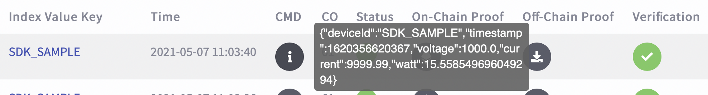
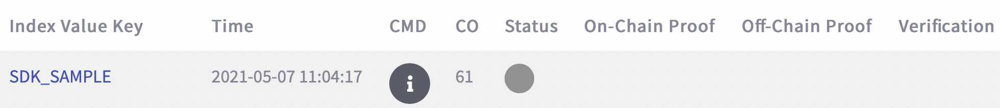

## 快速開始

### 關於快速開始

使用我們的 JAVA SDK 需要:

- ITM SPO JAVA SDK
- 執行 Windows 10, Mac OS, Linux 的機器

根據您的作業系統，Java SDK 支援下列數種開發環境

- Visual Studio Code (VScode)。但您需要安裝 VScode [Java Extension Pack](https://marketplace.visualstudio.com/items?itemName=vscjava.vscode-java-pack) 延伸套件，才能讓您在 VScode 上執行並開發我們的 SDK

- Command Line Interface (CLI)。

- IntelliJ IDEA

此份快速開始文件將透過下列 5 個步驟引導您開始使用我們的 SDK

<!-- no toc -->
1. [安裝所需套件](#1-安裝所需套件)
2. [下載 SDK](#2-下載-sdk)
3. [修改 SDK 設定檔](#3-修改-sdk-設定檔)
4. [執行範例程式](#4-執行範例程式)
5. [確認執行結果](#5-確認執行結果)

完成上述步驟後，您就可以參考教學文件中的範例整合及開發我們的 SDK。

### 1. 安裝所需套件

- 執行此 Java SDK 前，需先安 Java 8 以上的版本以及 `Maven`
- 若機器已經安裝上述套件，請透過 `java --version` 確認 java 版本為 8 以上
- 若無請用戶參考 [Java 官方網站](https://www.oracle.com/java/technologies/javase-downloads.html) 以及 [Maven 官方網站](https://maven.apache.org) 進行安裝或更新

### 2. 下載 SDK

- 下載 ITM SPO JAVA SDK

  ```shell
  git clone https://github.com/itrustmachines/itm-spo-sdk-java.git
  ```

### 3. 修改 SDK 設定檔

- 範例主程式 [SpoClientSample.java](../src/main/java/com/itrustmachines/sample/BnsClientSample.java) 中會使用此設定檔進行私鑰、區塊鏈位址、伺服器 ... 等設定，**本設定檔內容十分重要，請依照下方說明實作，再執行範例程式**

- 在修改設定檔前，請先依照下方兩點說明先取得私鑰以及區塊鏈位址
  
1. 為了確保每個資料來源的可信度，所以需要一組專屬私鑰進行數位簽章，避免他人冒用，**每個資料來源的私鑰必須唯一**。私鑰產生方式請參考下方指令執行程式，並將 privateKey 的內容複製貼上至 [sample.properties](../src/main/resources/sample.properties) 中 `privatekey` 欄位
  
    - MacOS, Linux 用戶

      ```shell
      $ cd itm-spo-sdk-java/itm-spo-sdk-key-generator 
      $ mvn clean install -DskipTests
      $ ./run_SpoKeyGenerator.sh
      [INFO] Scanning for projects...
      ...
      ...
      ...
      [INFO] 
      [INFO] --- exec-maven-plugin:3.0.0:java (default-cli) @ spo-sdk-key-generator ---
      privateKey = .......
      publicKey = 535d3e3b3e0eb7bbfe5f69068f25d64b4f8489510c0f4a25111016994d11f0cc4f4acb382d50a51eca9cd5f5bb1a14392613865ad0596144b700b078554ca4d3
      clientWalletAddress = 0xdccc511e05023581ae4b563b93d31672cf3c7743
      ```

    - Windows 用戶
      執行 run_SpoKeyGenerator.bat 檔

2. 我們使用以太坊 Rinkeby 測試鏈作為測試環境。為了向 Rinkeby 測試鏈取得鏈上證據，所以需要 Rinkeby 測試鏈節點位址。Rinkeby 測試鏈位址可透過 Infura 取得，請參考下方 Infura 教學連結
   
     - [Infura 教學](./infura_zh.md)

- 取得私鑰及 Rinkey 測試鏈位址後，我們可以開始修改設定檔 [sample.properties](../src/main/resources/sample.properties) ，修改方式請參考下方說明 :

    ```Java
    /**
     * 請按照描述依序填入，詳細資訊請參考下方說明
     * 填入由 itm-spo-sdk-key-generator 所產生的 32 Bytes (128 bits) Hex 編碼專屬私鑰
     * 取得方式請見上方說明
     */ 
    privateKey=

    /** 
     * 填入資料來源上鏈的索引值，需為唯一 
     * 若實作於裝置上可使用 deviceId 作為 indexValueKey
     */
    indexValueKey=SDK_SAMPLE

    /** 填入 SPO Server 的 URL */
    spoServerUrl=https://azure-prod-rinkeby.itm.monster:4430/
    
    /** 
     * 我們提供的測試環境使用以太坊 Rinkeby 測試鏈
     * 請確認此節點位址屬於 Rinkeby 測試鏈的節點位址，再填入 
     * 節點位址取得方式，請見上方說明
     */
    nodeUrl=https://rinkeby.infura.io/v3/{InfuraProjectId}
    
    /** 驗證會以分頁索取回條進行驗證，填寫此值設定分頁一次拿幾筆驗證， 預設為 10 筆 */
    verifyBatchSize=10

    /** 驗證會以分頁索取回條進行驗證，填寫此值設定每次驗證之間的時間間隔， 預設為 1 秒 */
    verifyDelaySec=1

    /** 當遇到網路問題無法順利得到 response， Client將會重試Request， 填寫此值設定每次嘗試的間隔時間， 預設為 5 秒 */
    retryDelaySec=5
    ```

### 4. 執行範例程式

#### Command Line Interface
```shell
  # 切換至 itm-spo-sdk-sample 資料夾
  $ cd itm-spo-sdk-java/itm-spo-sdk-sample

  # 執行主程式，將存證內容 LedgerInput 傳送至 SPO Server
  $ mvn clean install -DskipTests
  $ ./run_BnsClientSample.sh
```

#### Visual Studio Code

1. 開啟命令例
2. 輸入 Maven 並選擇 `Maven : Execute Commands`
4. 選擇 itm-spo-sdk-sample 專案
5. 選擇 Custom 並輸入 `clean package exec:java -Dexec.classpathScope=compile` 執行

#### Intellij IDEA

1. 開啟 itm-spo-sdk-java with Maven Project
2. Build 專案
3. 點選 Run Anything
4. 選擇 itm-spo-sdk-sample 專案
5. 輸入 `mvn clean package exec:java -Dexec.classpathScope=compile` 並執行

### 5. 確認執行結果

執行範例程式後，可透過 [ITM 公版 Dashboard](https://azure-prod-rinkeby.itm.monster:8443) 確認範例程式能否將資料傳送至 SPO Server 進行存證上鏈。確認步驟如下 :

  1. 用瀏覽器開啟 [ITM Dashboard](https://azure-prod-rinkeby.itm.monster:8443)

  2. 點擊畫面左側功能列的 Device

  3. 選擇資料來源，名稱為設定檔 [sample.properties](../src/main/resources/sample.properties) 中的 `INDEX_VALUE_KEY`

  4. 滑鼠移至 CMD 的圖示上方可以查看該筆資料的 CMD 內容

     

  5. 若該筆資料的 Status 顯示綠色則表示資料已上鏈

     
     灰色則表示未上鏈
     

  6. 資料狀態若為**綠色**已上鏈，可點擊 On-Chain Proof 連接至區塊鏈瀏覽器查看該筆資料在區塊鏈上的證據
  7. 資料狀態若為**綠色**已上鏈，可點擊 Off-Chain Proof 下載該筆資料的鏈下證據，該證據可以透過公開的 [Verification Server](https://verification.itrustmachines.com/) 或自行整合的 [Verification Program](https://github.com/itrustmachines/spo-verification-program) 來驗證資料是否有被竄改
  
     

  8. 點選 verification server icon
     

  9. 點選 Proof verification
     

  10. 上傳剛下載的 Off-chain proof
     

  11. 如果 Off-Chain proof 被篡改，verify result icon 會是綠色，否則，會是灰色
     

您已完成快速開始文件中所有教學步驟，並且已經成功將此 SDK 整合至您的裝置，接下來我們會引導你如何將想存證的資料設計成 CMD 傳送至 SPO Server

----

- [下一頁 : 設計存證內容 CMD](./cmd_zh.md)
- [上一頁 : ITM SPO MCU SDK 使用手冊](../README_ZH.md)
