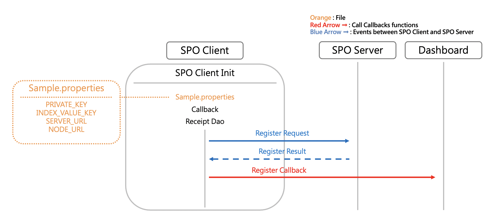
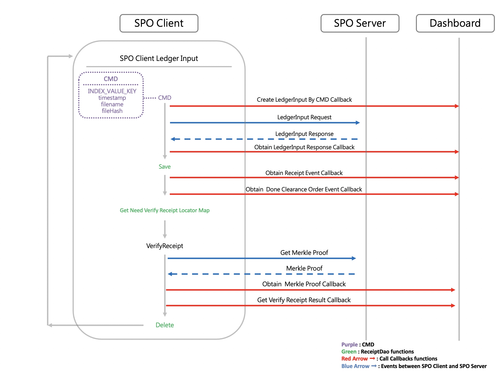

## Overview of SPO Client

### About the overview of SPO Client

If you want to explore our SDK in more details or modify our SDK, we recommand you go through this document. In this document, we will combine the previous tutorials and settings to guide you through the operation of SPO Client.

### Prerequisites

- Complete the quickstarts document
- Complete the CMD document
- Complete the Callback document
- Complete the ReceiptDao document
- Complete the other setting documents

### Configuration File

SPO Client will find the configuration file in `PROP_PATH_LIST`, and load the configuration file.

- [SpoClientSample.java](../src/main/java/com/itrustmachines/sample/BnsClientSample.java)
  
  ```java
  final String configPath = FileUtil.findFile(SAMPLE_PROPERTIES, PROP_PATH_LIST);
  final SpoClientConfig config = SpoClientConfig.load(configPath);
  log.info("SpoClientConfig={}", config);
  ```

### Callback Applications

Initialize the Callback Application with `DASHBOARD_URL`. You need to implement the code in Callback, otherwise, SPO Clien can only callback the events of `ledgerInputResult` and `verifyReceiptResult` to ITM Dashboard. Please refer to [Build thte Callback Applications](callback_en.md) for more informations.

- [SpoClientSample.java](../src/main/java/com/itrustmachines/sample/BnsClientSample.java)

  ```java
  final SpoClientCallback callback = new CallbackSample(DASHBOARD_URL);
  ```

For the code of Callback, please refer to [CallbackSample.java](../src/main/java/com/itrustmachines/sample/CallbackSample.java)  

### ReceiptDao Applications

Initialize the ReceiptDao Application with the sqlite database address, `JDBC_URL`. We provide several methods to save, find and delete the receipt. Please refer to [Build thte ReceiptDao Applications](receiptDao_en.md) for more informations.

- [SpoClientSample.java](../src/main/java/com/itrustmachines/sample/BnsClientSample.java)

  ```java
  final SpoClientReceiptDao receiptDao = new ReceiptDaoSample(JDBC_URL);
  ```

- For the code of the ReceiptDao Application, please refer to [ReceiptDaoSample.java](../src/main/java/com/itrustmachines/sample/ReceiptDaoSample.java).

- For the code of the database manipulation. Please refer to [ReceiptService.java](/../src/main/java/com/itrustmachines/sample/ReceiptService.java)

### Initialize SPO Client



Initialize the SPO Client with configuration file, callback and receiptDao. When initializing the SPO Client, SPO Client will register with SPO Server and call the `register` callback method and callback the `registerRequest` and `registerResult`

- [SpoClientSample.java](../src/main/java/com/itrustmachines/sample/BnsClientSample.java)

  ```java
  final SpoClient spoClient = SpoClient.init(config, callback, receiptDao);
  ```

- For the code of initialization, please refer to [SpoClient.java](../../spo-client/src/main/java/com/itrustmachines/client/BnsClient.java)

  ```java
  public static SpoClient init(@NonNull final SpoClientConfig config, @NonNull final SpoClientCallback callback,
      @NonNull final SpoClientReceiptDao receiptDao) {
    if (config.getVerifyBatchSize() <= 0) {
      config.setVerifyBatchSize(SpoClientConfig.DEFAULT_VERIFY_BATCH_SIZE);
    }
    SpoClient spoClient = new SpoClient(config, callback, receiptDao);
    final boolean isRegistered = spoClient.registerService.register();
    if (!isRegistered) {
      String errMsg = "SpoClient register fail";
      log.error("init() error, {}", errMsg);
      throw new RuntimeException(errMsg);
    }
    return spoClient;
  }
  ```

### LedgerInput
  


- After successfully initializing the SPO Client, SPO Client will convert `CMD` to JSON data type, `cmdJSON`, and do the ledgerInput. Check [Build the CMD](./cmd_en.md) for more informations.

- If you want to use our verification server to verify the file, please remember to use the `binaryLedgerInput`

- `ledgerInput` / `binaryLedgerInput` will store `cmdJSON` and other informations in `ledgerInputRequest` then call `createLedgerInputByCmd` to callback the informations in `ledgerInputRequest`

- After building the `ledgerInputRequest`, SPO Client will send `ledgerInputRequest` to SPO Server, and receive the `ledgerInputResponse` / `binaryLedgerInputResponse` from SPO Server. Then SPO Client will call `obtainLedgerInputResponse` / `obtainBinaryLedgerInputResponse` callback methods to send events to ITM Dashboard or the system you intergrate

- SPO Client call `handleReceipt` to extract the receipt from `ledgerInputResponse` / `binaryLedgerInputResponse` and store in database

- SPO Client call `handleDoneClearanceOrderList` to handle the `doneClearanceOrder` then find out the receipt which clearanceOrder is less than `doneClearanceOrder` to verify

- SPO Client will call `obtainReceiptEvent` and  `obtainDoneClearanceOrderEvent` callback methods to send the informations in `receipt` and `doneClearanceOrder` to ITM Dashboard or the system you intergrate. The `receipt` and `doneClearanceOrder` are contained in `ledgerInputResponse` / `binaryLedgerInputResponse`.
  
- For the code of `ledgerInput` and `binaryLedgerInput`, Please refer to [SpoClient.java](../../spo-client/src/main/java/com/itrustmachines/client/BnsClient.java)

  1. `ledgerInput(@NonNull final String indexValueKey, @NonNull final String cmdJson)`

     If there multiple device using one spo client program, we recommanded that you can use this method to specify `indexValueKey` by yourself.

     ```java
     public LedgerInputResponse ledgerInput(@NonNull final String indexValueKey, @NonNull final String cmdJson) {
        return ledgerInputService.ledgerInput(indexValueKey, cmdJson);
     }
     ```
  
  2. `ledgerInput(@NonNull final String cmdJson)`

      The default ledgerInput method use the `indexValueKey` in configuration file.

     ```java
     public LedgerInputResponse ledgerInput(@NonNull final String cmdJson) {
        return ledgerInputService.ledgerInput(config.getIndexValueKey(), cmdJson);
     }
     ```

  3. `binaryLedgerInput(@NonNull final String indexValueKey, @NonNull final String cmdJson, @NonNull final Path binaryPath)`

     If there multiple device using one spo client program, we recommanded that you can use this method to specify `indexValueKey` by yourself.

     ```java
     public BinaryLedgerInputResponse binaryLedgerInput(@NonNull final String indexValueKey, @NonNull final String cmdJson, @NonNull final Path binaryPath) {
        return binaryLedgerInputService.binaryLedgerInput(indexValueKey, cmdJson, binaryPath);
     }
     ```
  
  4. `binaryLedgerInput(@NonNull final String cmdJson, @NonNull final Path binaryPath)`

     The default ledgerInput method use the `indexValueKey` in configuration file.

      ```java
      public BinaryLedgerInputResponse binaryLedgerInput(@NonNull final String cmdJson, @NonNull final Path binaryPath) {
        return binaryLedgerInputService.binaryLedgerInput(config.getIndexValueKey(), cmdJson, binaryPath);
      }
      ```

### Verify

- Before verifying the receipt, SPO Client will call `getNeedVerifyReceiptLocatorMap` receiptDao method to find out the receipts which are need to be verified. Then SPO Client will request the merkleProof of the receipts to be verified from the SPO Server

- After obtaining the merkleProof, SPO Client will call `obtainMerkleProof` callback methods to send the event to ITM Dashboard or the system you intergrate then call `verify` method to start verifying the receipt

- After verifying the SPO Client, SPO Client will call `getVerifyReceiptResult` callback methods to send the event to ITM Dashboard or the system you intergrate

----

The User Guide is now complete. If you have any problem about our SDK, please feel free to contact us.

Next Page : [Home](../README.md)
Last Page : [Configure the Setting of SPO Client](./other_setting_en.md)
